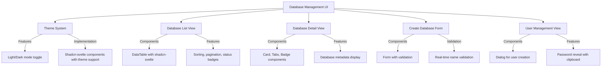

# Database Management UI Implementation Plan

## Theme System
- Implement light/dark mode toggle using shadcn-svelte components
- Add system preference detection
- Create theme context store



## Implementation Details

1. **Theme System Setup**
   - Create `src/lib/stores/theme.js` for theme management
   - Implement theme toggle component using shadcn-svelte's `Switch`
   - Add system preference detection using `matchMedia`
   - Update `app.postcss` with dark mode variants

2. **Database List Page**
   - Path: `/databases`
   - Component: `src/routes/databases/+page.svelte`
   - Use shadcn-svelte's `DataTable`
   - Columns: Name, Status, Created Date, Actions
   - API: GET /databases

3. **Database Creation Form**
   - Path: `/databases/new`
   - Component: `src/routes/databases/new/+page.svelte`
   - Use shadcn-svelte's `Form` components
   - Real-time validation for database name rules
   - Submit handling with loading state

4. **Database Detail Page**
   - Path: `/databases/[id]`
   - Component: `src/routes/databases/[id]/+page.svelte`
   - Use shadcn-svelte's `Card`, `Tabs`, and `Badge`
   - Sections: Overview, Users, Settings
   - API: GET /databases/{database_id}

5. **User Management**
   - Component: `src/lib/components/UserManagement.svelte`
   - User list with shadcn-svelte `Table`
   - "Add User" dialog with form
   - Password regeneration with reveal/copy functionality
   - APIs: 
     - GET/POST /databases/{database_id}/pgusers
     - POST /databases/{database_id}/pgusers/{pg_user_id}/regenerate-password

## Component Structure
```
src/
├── lib/
│   ├── components/
│   │   ├── ui/ (shadcn-svelte components)
│   │   ├── ThemeToggle.svelte
│   │   ├── DatabaseList.svelte
│   │   ├── CreateDatabaseForm.svelte
│   │   ├── DatabaseDetail.svelte
│   │   └── UserManagement.svelte
│   └── stores/
│       └── theme.js
└── routes/
    ├── databases/
    │   ├── +page.svelte (list view)
    │   ├── [id]/
    │   │   └── +page.svelte (detail view)
    │   └── new/
    │       └── +page.svelte (create form)
    └── +layout.svelte (theme provider)
```

## Next Steps
1. Implement theme system
2. Create database list component
3. Build database creation form
4. Develop database detail view
5. Implement user management